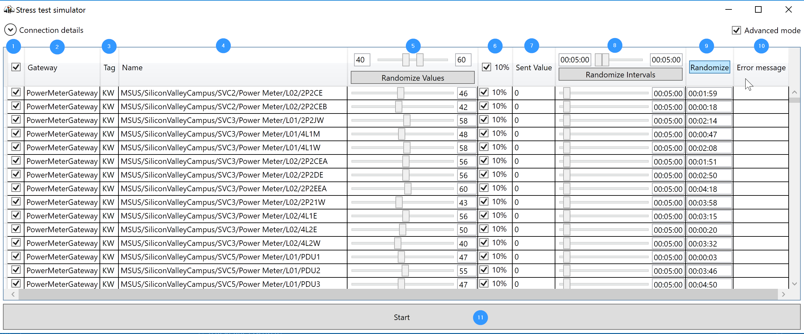

# Stress test simulator

## Use ##
The Stress test simulator is used to send data from a lot of simulated devices simultaneously.
It requires pulling BACmap addressing data from dbo.BACmap.

## Running the Stress test simulator ##
Launch `StressTestSimulator.exe` from the `StressTestSimulator` folder of the project. The initial screen:

Enter the database connection string and the IoT Hub connection string as in the instructions for the basic simulator and click Connect. In the next window, 
select the "Advanced mode" checkbox in the top right corner.  This brings up the following screen:

Select the sensor you want to emulate, and click Start to push data to the IoT Hub.

## Stress test simulator options ##

1. `Enabled/Disabled`
	- Disabled devices are not sending readings to IoT hub
2. `Gateway` - Gateway name
	- Corresponding azure IoT hub device should be registered with the same name as gateway name
3. `Tag` - Device Tag
4. `Name` - Full asset path
5. `Device value`
	- Values for all devices may be randomized, just specify randomizer range with slider and press `Randomize Values` button
6. `10%` - Adds +/-10% variation to device value when enabled
7. `Sent value` - the last value sent to IoT hub
8. `Interval` - sending interval, device will send data with specified time interval
	- Nay be randomized for all devices, by specifying lower and higher bounds and pressing `Randomize Intervals` button
9. `Next send in` - The device will send reading to IoT hub when counter reaches zero
	- Can be randomized within device `Interval` bu pressing `Randomize` button
10. `Error message` - will populate with error description text if device fails to send data for some reason

